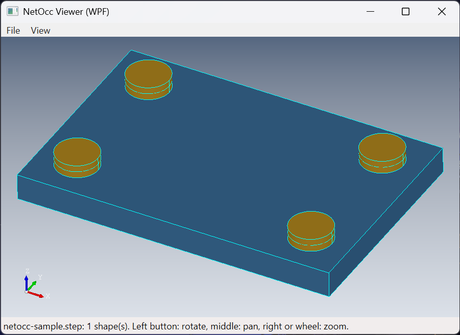
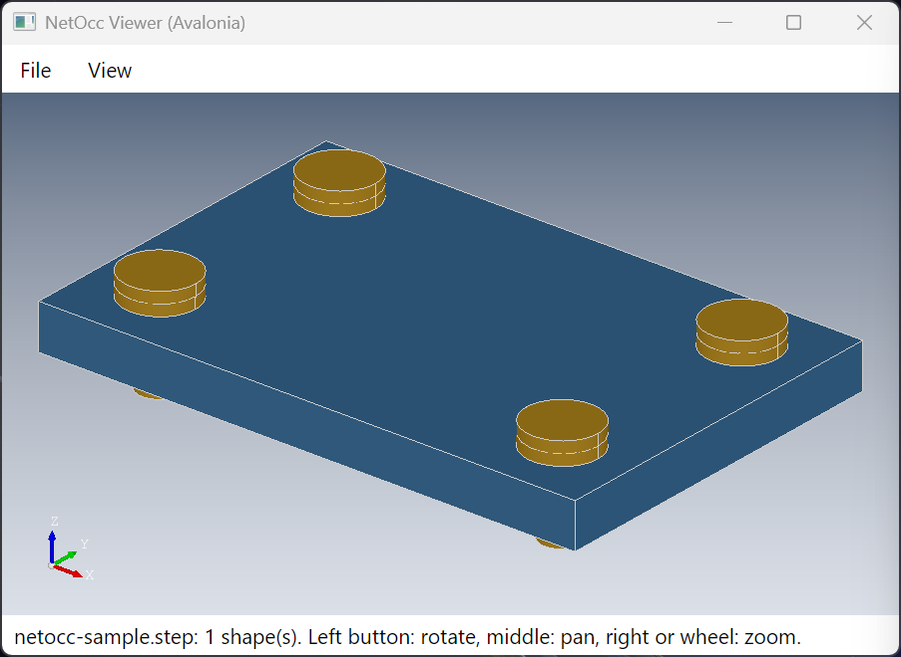

<div align="center">
  <h1>NetOcc</h1>
</div>

<div align="center">
  <p>Open CASCADE Technology 8.0.1 for .NET: C# bindings generated from OCCT's headers</p>
</div>

<div align="center">

<a href="https://github.com/paulbuechner/netocc/actions/workflows/build.yml">

</a>
<a href="https://www.nuget.org/packages/NetOcc">

</a>
<a href="https://paulbuechner.github.io/netocc/">

</a>
<a href="https://dev.opencascade.org">

</a>
<a href="LICENSE">

</a>

</div>

<br/>

[Open CASCADE Technology](https://dev.opencascade.org) (OCCT) for .NET, laid out like [pythonocc](https://github.com/tpaviot/pythonocc-core): one namespace per OCCT package (`OCC.Core.<Package>`), OCCT's names unchanged, so OCCT's reference manual and C++ samples apply as they are. IntelliSense shows OCCT's documentation.

## Install

```bash
dotnet add package NetOcc
```

One AnyCPU package for .NET Framework 3.5 and 4.5+, .NET 6, 8 and 10, and netstandard2.0, with the natives of every platform:

| Platform | Needs |
|---|---|
| Windows x64, x86 | the Visual C++ 2015-2022 runtime |
| Linux x64 | glibc 2.35 or newer |
| macOS arm64 | macOS 14 or newer |

## Example

```csharp
using System;
using OCC.Core.BRepAlgoAPI;
using OCC.Core.BRepGProp;
using OCC.Core.BRepPrimAPI;
using OCC.Core.GProp;
using OCC.Core.gp;
using OCC.Core.STEPControl;

namespace FusedPart;

internal static class Program
{
  private static void Main()
  {
    // a 10 x 20 x 30 box, and a cylinder of radius 3 standing in it
    var box = new BRepPrimAPI_MakeBox(10, 20, 30).Shape();
    var axis = new gp_Ax2(new gp_Pnt(5, 5, 0), new gp_Dir(0, 0, 1));
    var cylinder = new BRepPrimAPI_MakeCylinder(axis, 3, 40).Shape();

    // fused into one solid
    var fused = new BRepAlgoAPI_Fuse(box, cylinder).Shape();

    // its volume
    var properties = new GProp_GProps();
    BRepGProp.VolumeProperties(fused, properties);
    Console.WriteLine($"volume: {properties.Mass():F1}");

    // written as STEP
    var writer = new STEPControl_Writer();
    writer.Transfer(fused, STEPControl_StepModelType.STEPControl_AsIs);
    writer.Write("fused.step");
  }
}
```

## What's covered

All 362 packages of OCCT's FoundationClasses, ModelingData, ModelingAlgorithms, ApplicationFramework and DataExchange modules, and of Visualization's TKService, TKV3d, TKOpenGl and TKMeshVS:

- geometry, topology, booleans, fillets, offsets, sweeps, shape healing, meshing, HLR;
- OCAF and XCAF documents: assemblies, names, colors, undo;
- STEP, IGES, STL, glTF, OBJ, PLY and VRML files;
- 3D views in a WPF, Avalonia or any other native window.

## Documentation

[paulbuechner.github.io/netocc](https://paulbuechner.github.io/netocc/):

- [Guide](https://paulbuechner.github.io/netocc/articles/introduction.html): geometry, topology, modeling, meshing, files, documents, 3D views; every example compiles against the package in CI, and all but the on-screen views run there.
- [From C++ to C#](https://paulbuechner.github.io/netocc/articles/mapping.html): how OCCT's signatures look in C#.
- [Class index](https://paulbuechner.github.io/netocc/classes/index.html): every type, linked to OCCT's reference manual.

## Demos

A WPF and an Avalonia 12 viewer that open STEP files with their colors and assemblies: [netocc-demos](netocc-demos/README.md).

<table>
  <tr>
    <th>WPF</th>
    <th>Avalonia 12</th>
  </tr>
  <tr>
    <td></td>
    <td></td>
  </tr>
</table>

## Repository

| Folder | Content |
|---|---|
| [netocc-core](netocc-core) | typemap library, generated SWIG interfaces, native shims, the `NetOcc` assembly, tests, NuGet packages |
| [netocc-generator](netocc-generator) | `netocc-gen`: reads OCCT's headers and writes netocc-core's interface files |
| [netocc-documentation](netocc-documentation) | the documentation site and the examples it shows |
| [netocc-demos](netocc-demos) | the WPF and Avalonia viewers |

Building from source: [netocc-core/README.md](netocc-core/README.md), or the [building guide](https://paulbuechner.github.io/netocc/articles/building.html).

## Versions

A version is the OCCT version the bindings are generated for and NetOcc's revision: `8.0.1.2` is the second release for OCCT 8.0.1. Changes per release: [netocc-core/CHANGELOG.md](netocc-core/CHANGELOG.md).

## License

MIT, see [LICENSE](LICENSE). OCCT is LGPL-2.1 with the Open CASCADE exception, and so is the IntelliSense documentation taken from its headers, see [netocc-core/NOTICE](netocc-core/NOTICE). NetOcc is not affiliated with, endorsed by, or sponsored by Open Cascade SAS.
