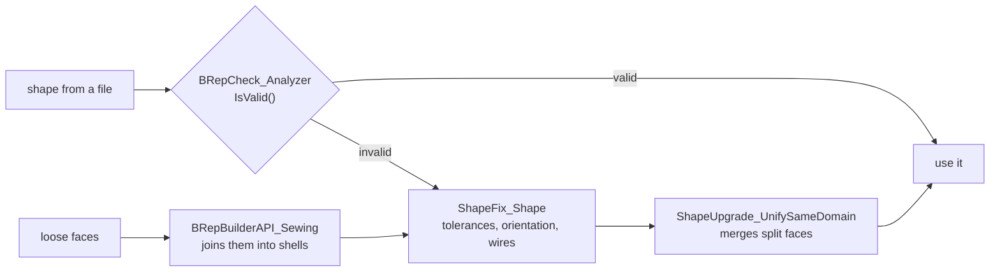

# Analysis and repair

## Properties

[!code-csharp]

| Function | `Mass()` is | For |
|---|---|---|
| `BRepGProp.VolumeProperties` | the volume | solids |
| `BRepGProp.SurfaceProperties` | the area | faces, shells, solids |
| `BRepGProp.LinearProperties` | the length | edges, wires |

`GProp_GProps` also gives `CentreOfMass()`, `MatrixOfInertia()`, `MomentOfInertia(axis)` and `PrincipalProperties()`. Results assume density 1: multiply by your material's density.

## Bounding boxes

[!code-csharp]

`BRepBndLib.Add` is fast and may overestimate; it uses the triangulation where there is one. `AddOptimal` is exact.

## Distances

[!code-csharp]

`BRepExtrema_DistShapeShape` works on any two shapes: vertices, edges, faces, solids. `NbSolution()` counts the pairs of closest points, `SupportOnShape1(i)` tells which sub-shape each lies on. `Value()` is 0 for touching or intersecting shapes, and for a shape inside a solid (`InnerSolution()` is then true).

## Inside or outside

[!code-csharp]

For many points on one solid, construct the classifier once with the solid and call `Perform(point, tolerance)` for each.

## Checking and repairing

Shapes from files, especially other systems' IGES and STEP, may have gaps, wrong tolerances or reversed faces. Algorithms given such shapes fail or produce garbage; check and repair first:

Six loose faces sewn into a shell, made a solid, fixed:

[!code-csharp]

`ShapeFix_Shape` runs the fixes of `ShapeFix_Solid`, `ShapeFix_Shell`, `ShapeFix_Face`, `ShapeFix_Wire` and `ShapeFix_Edge` as needed; each can also be run on its own for control over what changes. `ShapeAnalysis_*` classes report problems without changing anything.

## Merging faces

Booleans leave faces split where the inputs met, even on one surface:

[!code-csharp]
