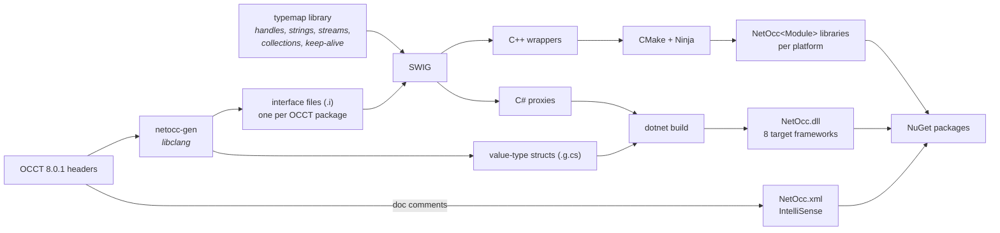
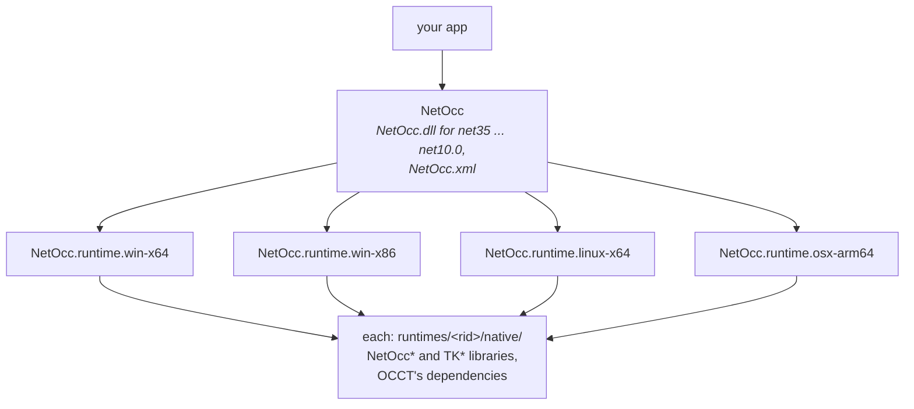
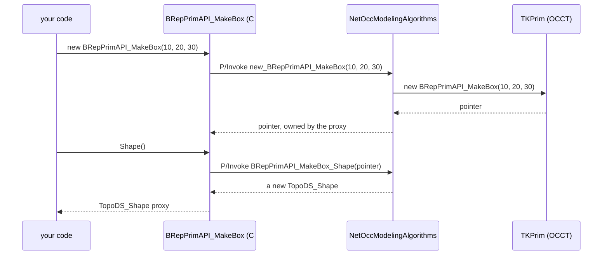
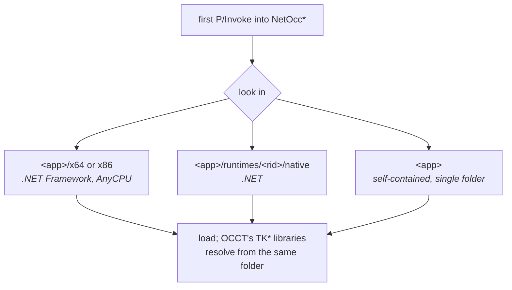

# How NetOcc works

## From headers to packages

- **netocc-gen** reads OCCT's headers with libclang and writes an interface file per package: which classes and members to wrap, how their handles, collections and references map. Members that can't be mapped are skipped with a reason.
- **SWIG** turns the interface files into C++ wrapper functions (`extern "C"`, one per member) and the C# proxies that call them.
- **The natives** are one library per OCCT module (`NetOccFoundationClasses`, `NetOccModelingData`, `NetOccModelingAlgorithms`, `NetOccDataExchange`, `NetOccApplicationFramework`, `NetOccVisualization`) plus `NetOccRuntime`, linked against OCCT's `TK*` libraries.

## Packages

## A call

Each call crosses into native code once, which costs around 10 ns (`shape.ShapeType()` on x64): nothing against a modeling algorithm, noticeable in loops over millions of nodes, where the bulk copies (`NodesToArray()`, `ToArray()`) help.

## Loading the natives

A module initializer runs before the first call: on .NET it registers a resolver for NetOcc's libraries, on .NET Framework it loads them up front. Both look next to the app:

On Windows each library loads with its own folder first in the search path, so another OCCT on `PATH` doesn't interfere.

## Documentation

`NetOcc.xml`, which IntelliSense shows, is written at pack time from OCCT's doc comments in its headers (LGPL, see the package's NOTICE). It's matched to NetOcc's members by class, member name and parameter names.
