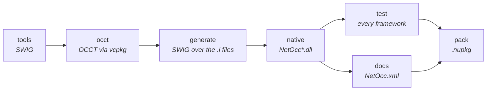

# Building from source

The [netocc repository](https://github.com/paulbuechner/netocc) holds four folders, each building on its own:

| Folder | Holds |
|---|---|
| `netocc-core` | the bindings: interface files, typemaps, native shims, the NetOcc assembly, tests, packaging |
| `netocc-generator` | `netocc-gen`: writes netocc-core's interface files from OCCT's headers |
| `netocc-documentation` | this site, and the samples it shows |
| `netocc-demos` | the WPF and Avalonia viewers |

## netocc-core

Needs Python 3.10+, a vcpkg clone (`VCPKG_ROOT`), CMake with Ninja, the .NET 10 SDK, and the .NET 6 and 8 runtimes for their tests. Per OS, also:

| OS | Needs |
|---|---|
| Windows | Visual Studio with the C++ tools; the .NET Framework 3.5 feature for the CLR 2 tests, which are skipped without it |
| Linux | `autoconf autoconf-archive automake libtool pkg-config libgl1-mesa-dev libglu1-mesa-dev libx11-dev libxext-dev libxi-dev`, or Docker: `docker/linux-x64.Dockerfile` runs every step |
| macOS | Xcode's command line tools and `brew install cmake ninja pkg-config`. Clone vcpkg: Homebrew's formula lacks its scripts. For the .NET 6 runtime, see [Pitfalls](pitfalls.md#build-and-deployment) |



```bash
cd netocc-core
python build.py tools                        # SWIG from conda-forge into .tools/
python build.py occt --triplet x64-windows   # OCCT 8.0.1 through vcpkg, about an hour the first time
python build.py generate                     # SWIG over the interface files
python build.py native --triplet x64-windows # native libraries into artifacts/runtimes/win-x64/native
python build.py test --arch x64              # every framework
python build.py docs --triplet x64-windows   # OCCT's doc comments as the package's IntelliSense (needs netocc-generator)
python build.py pack --rids win-x64          # NuGet packages into artifacts/packages
```

Triplets: `x64-windows`, `x86-windows`, `x64-linux-dynamic`, `arm64-osx-dynamic`.

### Checking a new platform

Where a port broke or could break, and how to see it:

| Area | Check |
|---|---|
| OCCT's exceptions | `.vcpkg/buildtrees/opencascade/<triplet>-rel/CMakeCache.txt` has `BUILD_RELEASE_DISABLE_EXCEPTIONS` off; otherwise the exception tests crash instead of throwing |
| Dependency lookup | The TK libraries resolve next to the shim: RUNPATH `$ORIGIN` (`readelf -d`, Linux), `@rpath` names and `LC_RPATH @loader_path` (`otool -L`, `otool -l`, macOS) |
| Loading | `LD_DEBUG=libs` (Linux) and `DYLD_PRINT_LIBRARIES=1` (macOS) show where each library comes from |
| Exports | The shims build with hidden visibility: `nm -gU <shim> \| grep -c CSharp_` counts the entry points; an `EntryPointNotFoundException` names a missing one |
| Code signing | arm64 macOS kills unsigned code (`killed: 9`). The linker signs ad hoc; `codesign -v` shows whether a copy step broke it |
| Layouts and strings | `static_assert`s in the interface files fail the native build on a different struct layout. `TCollection_ExtendedString` crosses as UTF-16, not `wchar_t` (32 bits off Windows); the non-ASCII tests cover it |

## Regenerating the interface files

Only needed after changing the generator or its configuration; the generated files are committed.

```bash
cd netocc-generator
dotnet run --project src/NetOcc.Generator -c Release -- generate --occt-src <sources> --occt-include <headers> --core ../netocc-core
```

`build.py occt` leaves OCCT's sources and headers under `netocc-core/.vcpkg`. With `--check`, `generate` only verifies the committed files are current.

## This site

```bash
cd netocc-documentation
dotnet tool restore
python classes.py                            # the class index, from netocc-core/src/SWIG_files/classes.json
dotnet test samples -c Release               # the examples, on netocc-core's packed NetOcc
dotnet docfx docfx.json --serve              # http://localhost:8080
```

The articles include regions of the samples (`[!code-csharp[](../samples/Geometry.cs#curves)]`), so every example on the site compiles. CI runs them on each change, all but the on-screen 3D views, which need a window and a GPU.
