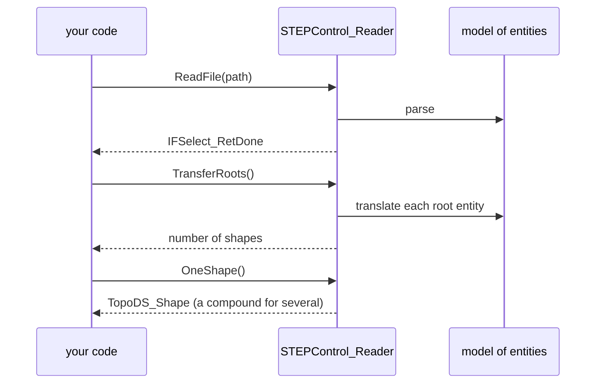

# Files

| Format | Shapes only | With names, colors, assemblies |
|---|---|---|
| STEP | `STEPControl_Reader`, `STEPControl_Writer` | `STEPCAFControl_Reader`, `STEPCAFControl_Writer` ([Assemblies](xcaf.md)) |
| IGES | `IGESControl_Reader`, `IGESControl_Writer` | `IGESCAFControl_Reader`, `IGESCAFControl_Writer` |
| BRep (OCCT's own) | `BRepTools.Read`, `BRepTools.Write`, `BinTools` (binary) | |
| STL | `StlAPI_Writer`, `RWStl.ReadFile` | |
| glTF | | `RWGltf_CafWriter`, `RWGltf_CafReader` |
| OBJ | | `RWObj_CafWriter`, `RWObj_CafReader` |
| PLY | | `RWPly_CafWriter` |
| VRML | `VrmlAPI_Writer` | `VrmlAPI_Writer.WriteDoc` |

STEP and IGES keep exact geometry. STL, glTF, OBJ and PLY hold triangles: [mesh](meshing.md) first.

## How readers work

The STEP and IGES readers work in two steps: `ReadFile` loads the file's entities into a model, `TransferRoots` translates them into shapes.

## STEP

[!code-csharp]

Paths are UTF-8 on every platform: `Ünïcödé.step` works. `NbRootsForTransfer()` and `TransferRoot(i)` translate roots one by one, `NbShapes()` and `Shape(i)` give them separately.

## IGES

[!code-csharp]

## BRep

OCCT's native format, exact and fast; the choice for caching shapes between runs.

[!code-csharp]

## Streams

Every reader and writer taking a `std::istream` or `std::ostream` takes a `System.IO.Stream`: files, memory, network.

[!code-csharp]

The stream is lent for the call: OCCT writes into a native buffer that's copied to the stream afterwards, and reads the stream's remaining bytes, leaving a seekable stream positioned where it stopped.

## STL

[!code-csharp]

`StlAPI_Reader` also reads STL, but into a face per triangle, slow and large for real meshes; `RWStl.ReadFile` gives one `Poly_Triangulation`.

## glTF and OBJ

The mesh formats with materials write XCAF documents:

[!code-csharp]

`RWObj_CafWriter` works the same way. Reading: `RWGltf_CafReader` and `RWObj_CafReader` fill a document (`SetDocument`, then `Perform(path, new Message_ProgressRange())`) with triangulated faces.

## Progress

Methods that take a `Message_ProgressRange` last, with a default, have an overload without it. A C# `Message_ProgressIndicator` reports and cancels through the range its `Start()` gives, see [Subclassing OCCT classes](subclassing.md#progress-and-cancellation); where OCCT requires a range and nothing reports, pass `new Message_ProgressRange()`.
