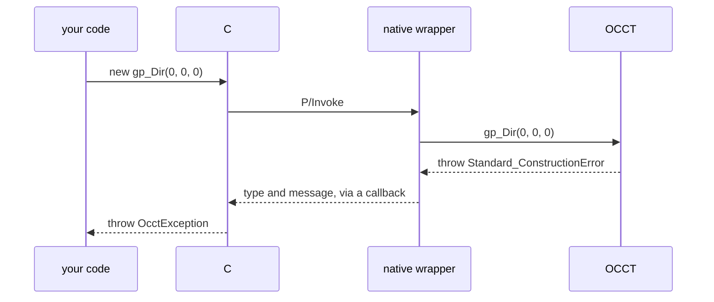
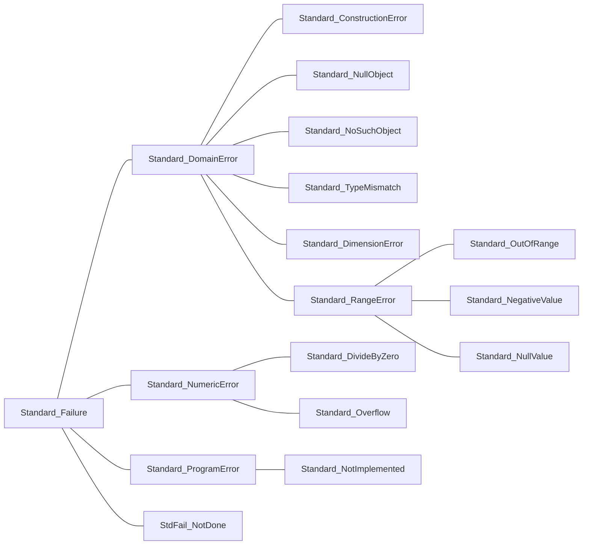

# Errors

OCCT reports failure two ways: exceptions (`Standard_Failure` and its subclasses) for invalid input, and status flags (`IsDone()`, `Error()`, `HasErrors()`) on algorithms that can fail on valid input.

## Exceptions

C++ exceptions never cross into .NET on their own. Every wrapper catches them and NetOcc throws an `OcctException` when the call returns:

[!code-csharp]

| Member | Gives |
|---|---|
| `OcctType` | the class OCCT threw: `Standard_ConstructionError`, or `std::exception` for the standard library's |
| `OcctMessage` | OCCT's message, if it gave one |
| `Is<T>()` | whether it's a `T` or a subclass, by OCCT's class hierarchy |

`Is<T>` follows the hierarchy, so catching a base class catches its subclasses:

[!code-csharp]

| Thrown for | Usually |
|---|---|
| `Standard_ConstructionError` | a degenerate input: a zero vector as a direction, coincident points |
| `Standard_DomainError` | an argument outside what the method accepts: a zero-size box |
| `Standard_OutOfRange` | an index outside a collection's bounds |
| `Standard_TypeMismatch` | a wrong cast: `TopoDS.Face` of an edge |
| `Standard_NoSuchObject` | a key a map doesn't have |
| `StdFail_NotDone` | the result of an algorithm that failed |

## Exceptions in overrides

A C# override OCCT calls ([Subclassing OCCT classes](subclassing.md)) can't unwind through C++. What it throws is caught at the boundary and rethrown in C++ right after the callback, as `NetOcc_ManagedException`: OCCT unwinds as from any `Standard_Failure`, and the `OcctException` of the outer call carries the override's exception as its `InnerException`.

[!code-csharp]

An exception OCCT catches itself goes no further, as in C++.

## Builders that fail

Builders check their input and record why they failed, without throwing:

[!code-csharp]

| Builder | Why it failed |
|---|---|
| `BRepBuilderAPI_MakeEdge` | `Error()`: `BRepBuilderAPI_EdgeError` |
| `BRepBuilderAPI_MakeWire` | `Error()`: `BRepBuilderAPI_WireError`, e.g. disconnected edges |
| `BRepBuilderAPI_MakeFace` | `Error()`: `BRepBuilderAPI_FaceError`, e.g. a non-planar wire |
| `BRepFilletAPI_MakeFillet` | `NbFaultyContours()`, `StripeStatus(i)` |
| `BRepAlgoAPI_*` | `HasErrors()`, `HasWarnings()`, `GetReport()` |

Where failure is possible on valid input, as with fillets whose radius doesn't fit, check before asking for the result:

[!code-csharp]

Booleans report through a message report instead:

[!code-csharp]

## What isn't checked

OCCT doesn't check everything, and a C++ crash ends the process: it can't be caught.

> [!WARNING]
> A null shape has no type: `new TopoDS_Shape().ShapeType()` crashes, as it does in C++, where it dereferences a null handle (exploring it, `Location()` and `NbChildren()` are safe). Check `IsNull()` on shapes an algorithm may leave empty, and `null` returns such as `BRep_Tool.Triangulation` of a face without a mesh.

NetOcc checks what it adds: its collection indexers, array lengths for fixed-size parameters, and `size_t` values on x86 throw `OcctException` rather than read out of bounds.
