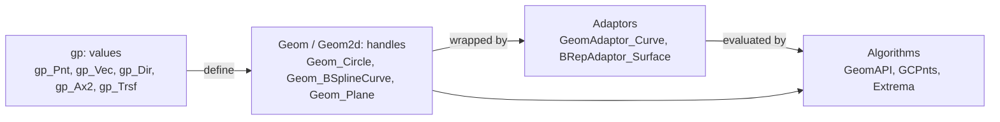
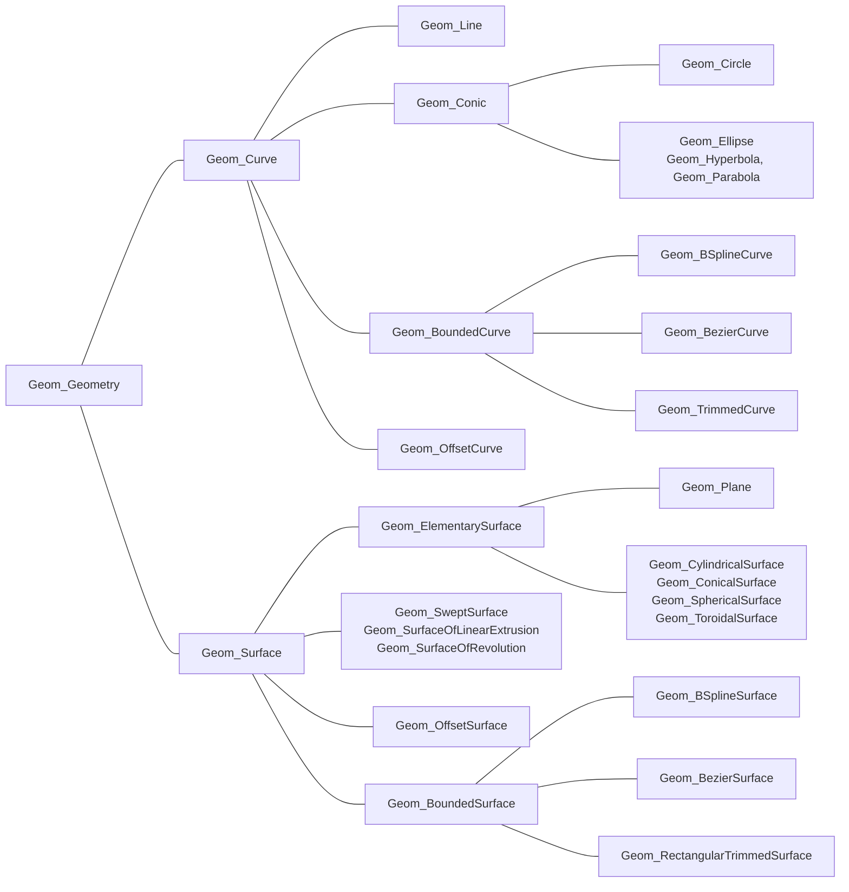

# Geometry

OCCT separates exact geometry from topology: `gp` has the math values (points, vectors, axes, transformations), `Geom` the curves and surfaces shapes are made of. Everything here is independent of shapes; [Topology](topology.md) builds on it.

## Values: gp

`gp` types are C# structs with OCCT's memory layout: no native allocation, copied on assignment. Their methods and operators run OCCT's code.

[!code-csharp]

OCCT's naming convention holds throughout: a verb changes the object (`Translate`, `Rotate`, `Normalize`), its participle returns a changed copy (`Translated`, `Rotated`, `Normalized`).

[!code-csharp]

> [!NOTE]
> Since `gp` types are structs, `var copy = point` copies. Mutating methods on a `readonly` field or a property's result change a temporary copy; assign the result of the participle form instead.

| Type | Holds |
|---|---|
| `gp_Pnt`, `gp_Vec`, `gp_Dir` | a point, a vector, a unit vector (normalized on construction) |
| `gp_Ax1` | a point and a direction: an axis of rotation |
| `gp_Ax2`, `gp_Ax3` | a right-handed (`Ax3`: either-handed) coordinate system |
| `gp_Trsf`, `gp_GTrsf` | a rigid transformation with uniform scale, a general affine one |
| `gp_Lin`, `gp_Circ`, `gp_Pln`, `gp_Cylinder` | elementary curves and surfaces as values |
| `gp_Pnt2d`, `gp_Vec2d`, ... | the same in 2D, for curves on surfaces |

## Transformations

`gp_Trsf` composes with `*`, applied right to left like OCCT's `Multiplied`:

[!code-csharp]

Shapes take transformations through locations, see [Modeling](modeling.md#transformations).

## Curves and surfaces: Geom

`Geom` types are OCCT transients: reference-counted, shared, and referred to through `Handle(T)`, which is just `T` in C#. Each is a parametric function: `Value(u)` for curves, `Value(u, v)` for surfaces.

[!code-csharp]

OCCT 8's `EvalD1` to `EvalD3` return the point with its derivatives as one plain struct (`Geom_Curve_ResD1` and so on) with public fields; `EvalD0` returns the point.

### Handles and casts

A C# cast never reaches the C++ object: a `Geom_Curve` that is a circle in C++ is a `Geom_Curve` proxy in C#. `DownCast` asks OCCT, like `Handle(Geom_Circle)::DownCast`:

[!code-csharp]

### Building curves

| To get | Use |
|---|---|
| a circle, arc, line segment from points | `GC_MakeCircle`, `GC_MakeArcOfCircle`, `GC_MakeSegment` (`.Value()`) |
| a B-spline approximating points | `GeomAPI_PointsToBSpline` |
| a B-spline through points, with tangents | `GeomAPI_Interpolate` |
| a B-spline surface through a grid | `GeomAPI_PointsToBSplineSurface` |
| a curve's length, points at even spacing | `GCPnts_AbscissaPoint`, `GCPnts_UniformAbscissa` |
| the 2D curve of a 3D curve on a plane | `GeomAPI.To2d` |

## Projection and extrema

[!code-csharp]

`GeomAPI_ProjectPointOnSurf`, `GeomAPI_ExtremaCurveCurve` and `GeomAPI_IntCS` (curve-surface intersection) work the same way: construct, check the number of results (`NbPoints()`, `NbExtrema()`), read them numbered from 1.

## Invalid input

Constructors check their arguments and throw:

[!code-csharp]

See [Errors](errors.md).
