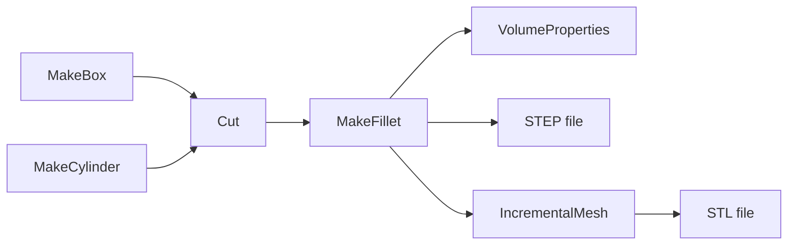

# Getting started

## Install

```bash
dotnet add package NetOcc
```

One AnyCPU package for .NET Framework 3.5 and 4.5+, .NET 6, 8 and 10, with the natives for win-x64, win-x86, linux-x64 and osx-arm64, and OCCT's documentation for IntelliSense.

> [!IMPORTANT]
> Windows needs the [Visual C++ 2015-2022 runtime](https://learn.microsoft.com/cpp/windows/latest-supported-vc-redist), Linux glibc 2.35 or newer, macOS 14 or newer on Apple silicon. See [Platforms](platforms.md).

## A first part

A block with a hole, rounded, measured, and written as STEP and STL:



Namespaces are OCCT's packages:

[!code-csharp[](../samples/GettingStarted.cs#usings)]

[!code-csharp[](../samples/GettingStarted.cs#first-part)]

What's going on:

- **Builders** (`BRepPrimAPI_MakeBox`, `BRepAlgoAPI_Cut`, `BRepFilletAPI_MakeFillet`) take their input in the constructor or through `Add`, and give the result through `Shape()`. See [Modeling](modeling.md).
- **`TopoDS_Shape`** is every shape: solids, faces, edges. `TopExp.MapShapes` collects the parts of one type, each once; `TopoDS.Edge` casts. See [Topology](topology.md).
- **`foreach`** works on OCCT's collections.
- **Meshing** stores triangles in the shape's faces; STL writes them. See [Meshing](meshing.md).

## Where next

| To | Read |
|---|---|
| get the big picture of OCCT | [Introduction](introduction.md) |
| work with points, curves and surfaces | [Geometry](geometry.md) |
| take shapes apart and build them from edges and faces | [Topology](topology.md) |
| read STEP files with colors and assemblies | [Assemblies](xcaf.md) |
| show shapes in a window | [3D views](visualization.md) |
| translate OCCT C++ code into C# | [From C++ to C#](mapping.md) |
| handle failures | [Errors](errors.md) |
