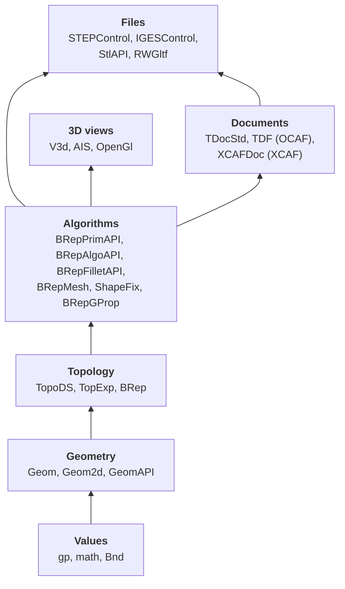
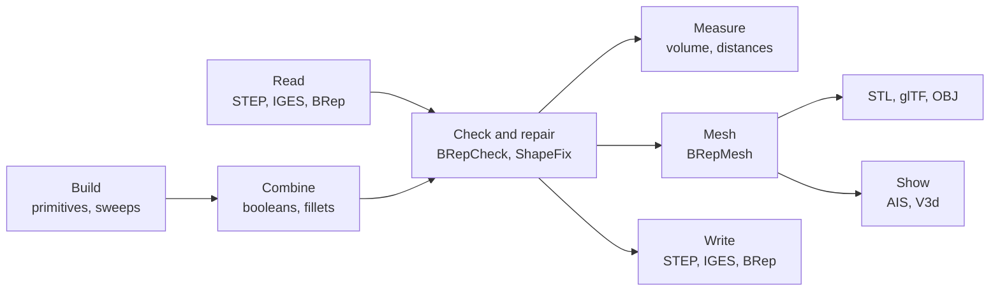

# Introduction

NetOcc is [Open CASCADE Technology](https://dev.opencascade.org) 8.0.1's C++ API in C#, generated from OCCT's headers. Names don't change: `gp_Pnt` is `gp_Pnt`, in namespace `OCC.Core.gp`. OCCT's [reference manual](../classes/index.md), its forum posts and C++ samples apply as they are, once you know [how signatures map](mapping.md).

## OCCT's layers

Each layer builds on the ones below. The guide follows them bottom-up.

## A typical program

## Packages by task

| Task | Namespaces (`OCC.Core.*`) | Guide |
|---|---|---|
| Points, vectors, transformations | `gp`, `math`, `Bnd` | [Geometry](geometry.md) |
| Curves and surfaces | `Geom`, `Geom2d`, `GC`, `GeomAPI`, `GCPnts` | [Geometry](geometry.md) |
| Shapes and their parts | `TopoDS`, `TopExp`, `TopTools`, `BRep`, `BRepTools` | [Topology](topology.md) |
| Building shapes | `BRepBuilderAPI`, `BRepPrimAPI`, `BRepOffsetAPI` | [Modeling](modeling.md) |
| Booleans, fillets, offsets | `BRepAlgoAPI`, `BRepFilletAPI`, `BRepOffsetAPI` | [Modeling](modeling.md) |
| Properties, checks, repair | `BRepGProp`, `BRepBndLib`, `BRepExtrema`, `BRepCheck`, `ShapeFix`, `ShapeUpgrade` | [Analysis and repair](analysis.md) |
| Triangles | `BRepMesh`, `Poly` | [Meshing](meshing.md) |
| Files | `STEPControl`, `IGESControl`, `StlAPI`, `RWStl`, `RWGltf`, `RWObj` | [Files](data-exchange.md) |
| Assemblies, colors, names | `XCAFDoc`, `XCAFApp`, `STEPCAFControl` | [Assemblies](xcaf.md) |
| Application data, undo | `TDocStd`, `TDF`, `TDataStd`, `TNaming` | [Documents](ocaf.md) |
| 3D views | `V3d`, `AIS`, `OpenGl`, `Aspect`, `Graphic3d` | [3D views](visualization.md) |

## Reading the examples

Every example on this site is a region of a test in [netocc-documentation/samples](https://github.com/paulbuechner/netocc/tree/main/netocc-documentation/samples), compiled against the NetOcc package on each change and run, except the on-screen 3D views, which need a window and a GPU. They use C# 12 (collection expressions, `using` declarations); on .NET Framework set `<LangVersion>latest</LangVersion>` or spell those out.

Lengths are plain numbers: OCCT has no unit type, and its file readers and writers assume millimetres unless told otherwise.
