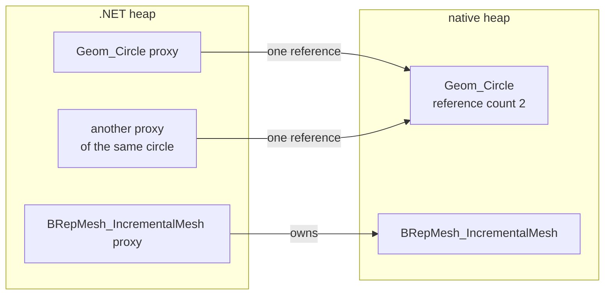
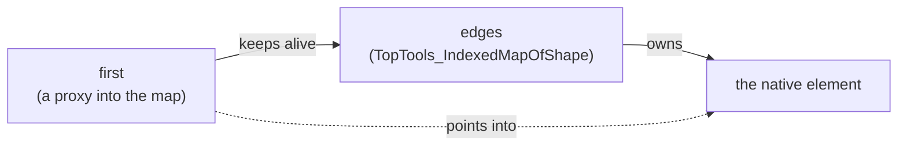
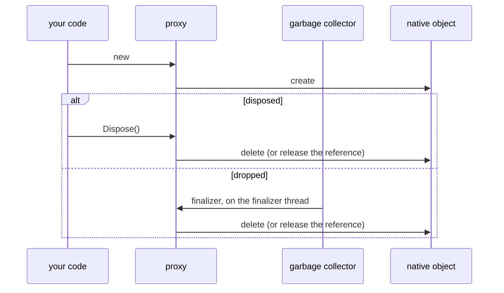

# Object lifetimes

A proxy owns its native object, or for a transient one reference on it, and releases it in `Dispose` or its finalizer. The garbage collector sees only the small proxy, not the native memory behind it: dispose large or scarce objects when you're done with them.

[!code-csharp]

| Dispose promptly | Why |
|---|---|
| views, drivers, viewers | GPU resources, and they belong to one thread |
| documents | close through the application, see [Documents](ocaf.md#files) |
| meshers, large algorithms | megabytes of intermediate data |
| shapes, points, small objects | no need: the finalizer is fine |

## What stays alive with what

C++ code keeps raw references the garbage collector doesn't see: an algorithm referring to the shape it was given, a proxy for an element inside a map. NetOcc keeps the C# side alive as long as the native object may use it, so no `GC.KeepAlive` is needed:

[!code-csharp]

| The native object refers to | Kept alive by |
|---|---|
| its owner, for a reference a member returned (`map.FindKey(1)`, `block.ChangeShapes()`) | the returned proxy |
| a constructor's argument (`new BRepGraph_FaceIterator(graph)`, a boolean's shared `BOPAlgo_PaveFiller`) | the new proxy |
| a member's argument (`extrema.Initialize(surface, ...)`) | the proxy, until the member's next call replaces it |
| the object it came from (`editor.Mut(vertex)` returns a guard into the graph) | the returned proxy |
| the object a returned copy refers to (`graph.Topo()` returns a view of the graph) | the returned proxy |

What a constructor keeps, and the object behind a returned guard, also outlive the finalizer: finalizers run in any order, and a destructor may still use them.

## Guards

A guard locks an item until it's disposed. One dropped without `Dispose` is safe, but its item stays locked until the collector finalizes it, so dispose guards with `using`:

[!code-csharp]

## Finalization

## C# subclasses

A C# subclass of an OCCT class ([Subclassing OCCT classes](subclassing.md)) is reached from C++, which the garbage collector doesn't see. NetOcc keeps such an object alive while OCCT holds a reference to it: from the moment it's passed to OCCT until a collection finds its proxy's reference the only one left. Disposing it while OCCT holds it releases it once OCCT lets go, and OCCT handing it back gives the same C# instance.

## OCAF documents

- Labels, attributes and `TNaming_Builder` keep their document's data alive, so a proxy never points into a freed tree.
- Close documents through the application (`application.Close(document)`): OCCT keeps a raw pointer to the document that only `Close` clears.
- Undo needs `document.SetUndoLimit(n)` with `n > 0`; with 0, `OpenCommand` and `AbortCommand` do nothing.
- `XCAFApp_Application.GetApplication()` is one per process.

## Threads

Finalizers run on the collector's thread. Objects with a GL context (views, drivers) belong to the thread that made them: dispose them there, don't leave them to the finalizer. OCCT's modeling objects aren't thread-safe: share a shape between threads only for reading.
