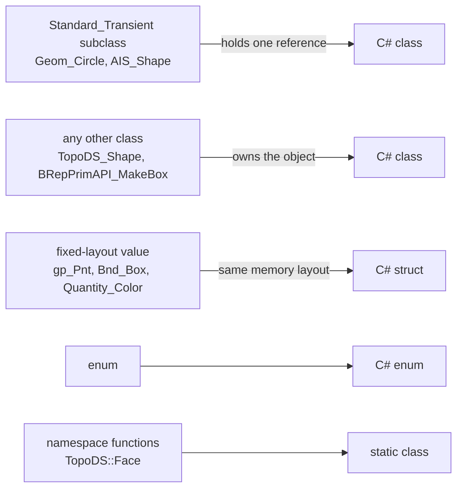

# From C++ to C#

NetOcc is generated from OCCT's headers: a C++ signature decides its C# signature. With the rules below, OCCT's [reference manual](../classes/index.md) and C++ code translate line by line.

## What a C++ type becomes

All classes are `IDisposable`, see [Object lifetimes](lifetimes.md).

## Names

| C++ | C# |
|---|---|
| package `gp`, class `gp_Pnt` | namespace `OCC.Core.gp`, `gp_Pnt` |
| nested `Geom_Curve::ResD1` | `Geom_Curve_ResD1`: scopes joined by `_` |
| namespace functions `TopoDS::Face(shape)` | a static class: `TopoDS.Face(shape)` |
| `GeomAbs_CurveType` enum | a C# enum with OCCT's values and underlying type |
| `typedef NCollection_Array1<gp_Pnt> TColgp_Array1OfPnt` | class `TColgp_Array1OfPnt` |
| a parameter named like a C# keyword (`string`) | suffixed: `string_` |

## Handles

`Handle(T)` is `T`: the proxy holds one reference on the object, and `null` is a null handle. A C# cast never reaches the C++ object, so casts go through `DownCast`:

[!code-csharp]

## Value types

All of `gp`, `Bnd_Box`, `Quantity_Color`, `Poly_Triangle` and a few more are C# structs with OCCT's memory layout: no allocation, passed by pointer to OCCT. Their methods run OCCT's code, and OCCT's arithmetic operators (`+`, `-`, `*`, `/`, `^`) are C# operators. Other classes have none; OCCT's operators mostly repeat a named member, which they have (`Multiplied`, `IsEqual`, `Value`):

[!code-csharp]

Plain data (OCCT 8's evaluation results) is a struct with public fields: `curve.EvalD1(u).Point`.

## Parameters

| C++ | C# |
|---|---|
| `T&` of a number, enum or struct | `ref T` (never `out`: OCCT may read it first) |
| `const T&` of a struct | `in T` |
| `T&` or `const T&` of a class | the proxy |
| `Handle(T)&` | `ref T`: the variable gets the object OCCT puts there |
| `T*` of numbers or structs | a C# array, pinned for the call (`double[]`, `gp_Pnt[]`) |
| `T*` of a class | the proxy, `null` for `nullptr` |
| `void*`, function pointers, pointers OCCT keeps | `IntPtr` |
| `int (&)[3]` | an array of exactly three |
| `Message_ProgressRange` at the end, defaulted | an overload without it too, like any default |
| default arguments | overloads |
| a virtual member of a [class C# subclasses](subclassing.md) | `virtual` (protected ones `protected virtual`); OCCT calls the override |

[!code-csharp]

A member returning `T&` of a number, enum or struct is a C# `ref` return, read and written in place:

[!code-csharp]

A member returning a class by reference gives a proxy that borrows the object and keeps its owner alive. So does a copy that refers to its owner, such as `BRepGraph.Topo()`'s view of the graph or `V3d_Viewer.ActiveViewIterator()`'s iterator over the viewer's views. A member returning `*this` for chaining returns `void`.

## Collections

OCCT's arrays, lists, sequences and maps are C# classes named by OCCT's aliases, `IEnumerable<T>`, with indexers using OCCT's bounds:

[!code-csharp]

| Collection | Indexed | From |
|---|---|---|
| `*_Array1Of*`, `*_Array2Of*` | by the bounds given (`Lower()` to `Upper()`) | a C# array: 1 |
| `*_SequenceOf*` | yes | 1 |
| `*_ListOf*` | no: enumerate, `First()`, `Last()` | |
| `*_IndexedMapOf*`, `*_IndexedDataMapOf*` | by number, and `FindIndex(key)` | 1 |
| `*_MapOf*` | no: a set, `Contains(key)` | |
| `*_DataMapOf*` | by key, `ContainsKey(key)`; enumerates `KeyValuePair`s | |

The handle-managed variants (`TColgp_HArray1OfPnt`) derive from their collection. `Count` is OCCT's `Extent()` or `Length()`. A bad index throws:

[!code-csharp]

## Strings and the standard library

[!code-csharp]

| C++ | C# |
|---|---|
| `const char*`, `TCollection_AsciiString`, `std::string`, `std::string_view` | `string` (UTF-8) |
| `const char16_t*`, `TCollection_ExtendedString` | `string` (UTF-16) |
| `Standard_GUID` | `System.Guid` |
| `std::array<double, 3>` | `double[]` |
| `std::optional<T>` | `T?` |
| `std::pair<A, B>` | a class with `First` and `Second` |
| `std::bitset<N>` | `ulong` |
| `std::complex<double>` | `OCC.Core.Complex` |
| `std::ostream&`, `std::istream&` | `System.IO.Stream`, see [Files](data-exchange.md#streams) |
| `char` | `byte` (its bits, not a character) |
| `char32_t` | `uint` (a code point) |
| `size_t` | `ulong`; on x86 a larger value throws `OcctException` |

## Errors

OCCT's `Standard_Failure` and its subclasses arrive as `OcctException`, see [Errors](errors.md).

## Deprecated and left out

What OCCT marks deprecated is wrapped and `[Obsolete]`. What can't be mapped is left out, each member with its reason in [Skipped members](skipped.md): members OCCT declares but never exports, raw pointers into structs, streams OCCT would keep beyond a call, template instances C# can't create or name.
