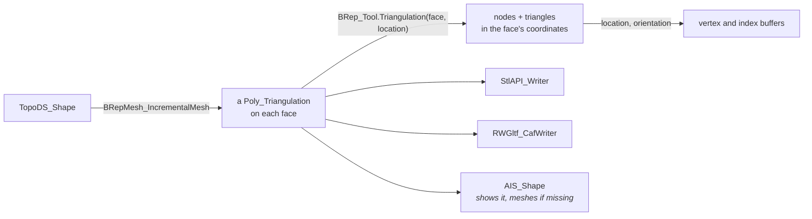

# Meshing

Renderers, STL and glTF files, and FEM need triangles. `BRepMesh_IncrementalMesh` triangulates each face and stores the result in the shape; `BRep_Tool.Triangulation` reads it back.

## Triangulating

[!code-csharp]

| Parameter | Means |
|---|---|
| linear deflection | the largest distance between a triangle and the surface, in model units |
| relative | `true`: the deflection is a fraction of each edge's size |
| angular deflection | the largest angle, in radians, between neighbouring triangles' normals on curved faces |
| parallel | mesh faces on all cores |

The deflection trades accuracy for size: halving it roughly doubles the triangles on curved faces. For rendering, a deflection of about 0.1% of the model's size looks smooth.

## Meshing again

[!code-csharp]

## Reading the triangles

Each face's nodes are in the face's own coordinates: apply the location `BRep_Tool.Triangulation` writes. A reversed face points its triangles the other way: swap two indices to keep normals outward.

[!code-csharp]

`NodesToArray()` and `TrianglesToArray()` copy everything in one native call; `Node(i)` and `Triangle(i)` cost a call each. With `BRepLib_ToolTriangulatedShape.ComputeNormals(face, triangulation)` the triangulation gets normals, read with `Normal(i)`.

> [!NOTE]
> Edges have their own polygons on the triangulation (`BRep_Tool.PolygonOnTriangulation`), which line up with the faces' nodes: use them to draw edges that match the shading.

## Writing triangles

STL: see [Files](data-exchange.md#stl). glTF and OBJ write XCAF documents, with colors and names: see [Files](data-exchange.md#gltf-and-obj).
