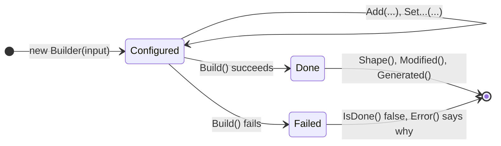
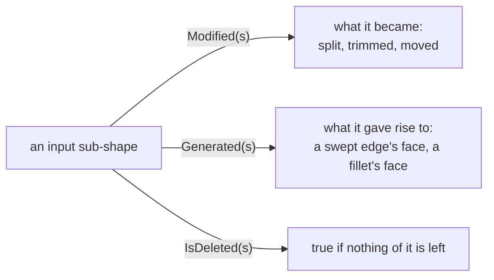

# Modeling

Every modeling algorithm is a builder: input in the constructor (or through `Add` and `Set...`), `Build()`, the result from `Shape()`.

`Shape()` builds first if needed; on a failed builder it throws `StdFail_NotDone`. Check `IsDone()` where failure is possible, see [Errors](errors.md#builders-that-fail).

## Primitives

[!code-csharp]

`BRepPrimAPI_MakeBox` also names its faces (`TopFace()`, `BottomFace()`, `FrontFace()`, `BackFace()`, `LeftFace()`, `RightFace()`), handy for picking a face to fillet, shell or cut.

## Sweeps

| Builder | Sweeps | Result from a face |
|---|---|---|
| `BRepPrimAPI_MakePrism` | along a vector (or infinitely along a direction) | a solid |
| `BRepPrimAPI_MakeRevol` | about an axis, a full turn or an angle | a solid |
| `BRepOffsetAPI_MakePipe` | along a wire | a solid |
| `BRepOffsetAPI_MakePipeShell` | wires along a wire, with control of the profile's orientation (`SetMode`) | a shell, `MakeSolid()` closes it |
| `BRepOffsetAPI_ThruSections` | through a series of wires (a loft) | a solid or a shell |

Sweeping a vertex gives an edge, an edge a face, a wire a shell, a face a solid.

[!code-csharp]

## Booleans

[!code-csharp]

| Builder | Result |
|---|---|
| `BRepAlgoAPI_Fuse` | the union |
| `BRepAlgoAPI_Common` | the intersection |
| `BRepAlgoAPI_Cut` | the first less the second |
| `BRepAlgoAPI_Section` | the intersection edges |
| `BRepAlgoAPI_Splitter` | the arguments split by the tools, all pieces kept |

With many tools, one operation is faster and more robust than a chain of them. The empty constructor takes lists and options:

[!code-csharp]

| Option | Does |
|---|---|
| `SetFuzzyValue(tolerance)` | treats gaps and overlaps below the tolerance as touching |
| `SetRunParallel(true)` | uses all cores |
| `SetNonDestructive(true)` | leaves the input shapes unchanged; by default their tolerances may grow |
| `SetGlue(...)` | a faster path for arguments that only touch or share whole faces |
| `SimplifyResult()` | merges faces and edges on the same surface afterwards |

## History

Builders tell what became of each input sub-shape, to follow a face through a sequence of operations:

[!code-csharp]

`Modified` and `Generated` return a `TopTools_ListOfShape`: empty when nothing applies.

## Fillets and chamfers

[!code-csharp]

`Add(r1, r2, edge)` makes a fillet whose radius varies from `r1` to `r2` along the edge. Edges that meet tangentially join one contour, `NbContours()` counts them. If one contour fails, `IsDone()` is false; `NbFaultyContours()` and `FaultyContour(i)` tell which.

## Offsets and shells

[!code-csharp]

| Builder | Does |
|---|---|
| `BRepOffsetAPI_MakeThickSolid` | hollows a solid, removing faces to open it |
| `BRepOffsetAPI_MakeOffsetShape` | offsets every face of a shape (`PerformByJoin`) |
| `BRepOffsetAPI_MakeOffset` | offsets a planar wire within its plane |

## Transformations

[!code-csharp]

| To | Use | Geometry |
|---|---|---|
| place a shape (rotation, translation) | `shape.Moved(location)`, `shape.Located(location)` | shared |
| transform with uniform scale or mirror | `BRepBuilderAPI_Transform(shape, trsf, true)` | copied |
| scale unevenly | `BRepBuilderAPI_GTransform` with a `gp_GTrsf` | converted to B-splines |
| copy a shape to change it separately | `BRepBuilderAPI_Copy` | copied |

`Moved` composes with the shape's current location, `Located` replaces it.
