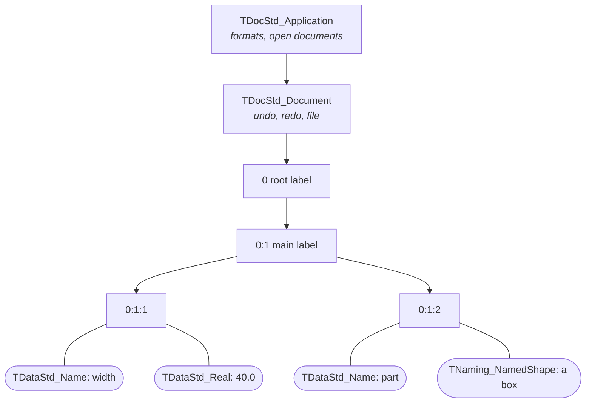
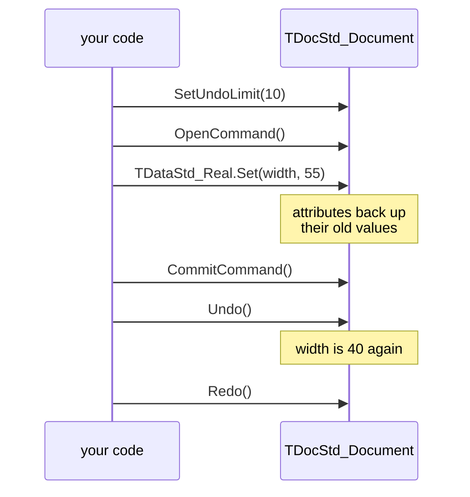

# Documents

OCAF (the Open CASCADE Application Framework) stores application data in a tree of labels carrying attributes, with undo, redo and files for free. [XCAF](xcaf.md) is built on it.

A label is a place in the tree, named by its path of tags (its entry, `0:1:2`). An attribute is data on a label, at most one per attribute class (per GUID).

## Labels and attributes

[!code-csharp]

[!code-csharp]

| Attribute | Holds |
|---|---|
| `TDataStd_Name` | a name |
| `TDataStd_Integer`, `TDataStd_Real`, `TDataStd_AsciiString` | a value |
| `TDataStd_IntegerArray`, `TDataStd_RealArray`, `TDataStd_ExtStringArray` | an array |
| `TDataStd_TreeNode` | a link into a tree other than the labels' |
| `TDataStd_UAttribute` | nothing: a marker, found by its GUID |
| `TNaming_NamedShape` | a shape, with its history (`TNaming_Builder`: `Generated`, `Modify`, `Delete`) |
| `TDF_Reference` | a link to another label |

`FindAttribute` takes the class's GUID (`TDataStd_Real.GetID()`) and gives a `TDF_Attribute`: `DownCast` it. `Set` on a label with the attribute already there changes it.

## Undo and redo

Changes between `OpenCommand` and `CommitCommand` form one undoable step:

[!code-csharp]

`AbortCommand()` drops the changes since `OpenCommand()`. With `SetNestedTransactionMode(true)`, commands nest.

## Files

[!code-csharp]

| Format | Drivers | File |
|---|---|---|
| `BinOcaf` | `BinDrivers.DefineFormat(application)` | binary, `.cbf` |
| `XmlOcaf` | `XmlDrivers.DefineFormat(application)` | XML, `.xml` |
| `BinXCAF` | `BinXCAFDrivers.DefineFormat(application)` | binary XCAF, `.xbf` |
| `XmlXCAF` | `XmlXCAFDrivers.DefineFormat(application)` | XML XCAF, `.xml` |

`SaveAs` and `Open` also take a `System.IO.Stream`.

> [!IMPORTANT]
> Close documents through their application, `application.Close(document)`: the application holds a raw pointer to each document it opened, which only `Close` clears. Disposing the proxy isn't enough.
