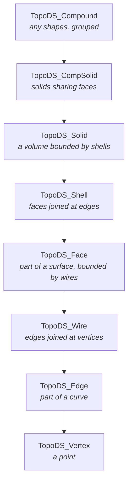
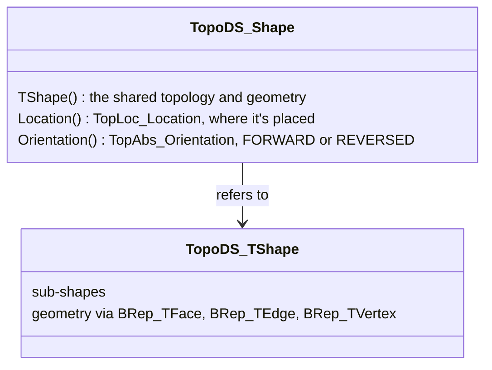
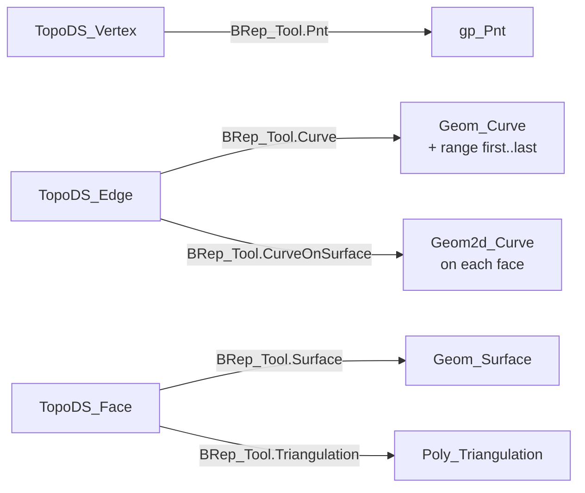

# Topology

A shape is topology (what is connected to what) over geometry (where it is): faces lie on surfaces, edges on curves, vertices at points. `TopoDS` holds the topology, `BRep_Tool` reads the geometry behind it.

## The shape types

`TopoDS_Shape` is the base of all; each type is made of the one below:

`ShapeType()` tells which one a `TopoDS_Shape` is; `TopoDS.Solid`, `TopoDS.Face`, `TopoDS.Edge` and so on cast to it, and throw `Standard_TypeMismatch` for the wrong type.

## What a shape is

A `TopoDS_Shape` is a light value: a reference to the shared `TopoDS_TShape` that holds the topology, a location and an orientation. Two shapes can share the TShape and still differ:

[!code-csharp]

| Compare | Same TShape | Same location | Same orientation |
|---|---|---|---|
| `IsPartner` | yes | | |
| `IsSame` | yes | yes | |
| `IsEqual` | yes | yes | yes |

Maps and `TopExp` use `IsSame`: a face and its reversed twin are one entry.

## Exploring

[!code-csharp]

| Tool | Gives | Duplicates |
|---|---|---|
| `TopExp_Explorer(shape, type)` | every sub-shape of a type, at any depth | yes: once per occurrence |
| `TopExp.MapShapes(shape, type, map)` | the same, into a `TopTools_IndexedMapOfShape` numbered from 1 | no |
| `TopoDS_Iterator(shape)` | the direct children only | yes |
| `TopExp.MapShapesAndAncestors` | each sub-shape with the shapes containing it | no |

[!code-csharp]

`TopExp.FirstVertex(edge)`, `LastVertex`, `Vertices(edge, first, last)` (fills two `TopoDS_Vertex`) and `CommonVertex` answer the usual questions about edges.

## Geometry behind the topology

[!code-csharp]

Every sub-shape carries a tolerance: the distance within which its geometry is considered to meet its neighbours'. Tolerances grow as algorithms work; `BRep_Tool.Tolerance` reads them.

> [!TIP]
> For evaluating a face or an edge, `BRepAdaptor_Surface` and `BRepAdaptor_Curve` apply the shape's location and bounds for you: `new BRepAdaptor_Surface(face).Value(u, v)`.

## Building bottom-up

Vertices, edges, wires, faces: each `BRepBuilderAPI_Make*` takes the level below.

[!code-csharp]

| Builder | From |
|---|---|
| `BRepBuilderAPI_MakeVertex` | a `gp_Pnt` |
| `BRepBuilderAPI_MakeEdge` | two points, a `gp_Lin`/`gp_Circ`, a `Geom_Curve` with or without a range |
| `BRepBuilderAPI_MakeWire` | up to four edges, or `Add` edges and wires; they must connect |
| `BRepBuilderAPI_MakePolygon` | points, closed with `true` or `Close()` |
| `BRepBuilderAPI_MakeFace` | a planar wire, a `Geom_Surface` with bounds, a surface and a wire |
| `BRepBuilderAPI_MakeShell`, `MakeSolid` | a surface; shells |

Faces from wires need planar wires; for anything else build the surface first, or use `BRepFill_Filling` or `BRepOffsetAPI_MakeFilling`.

## Compounds

[!code-csharp]

A compound is the usual result of reading a file with several shapes, and a cheap way to pass many shapes as one.
