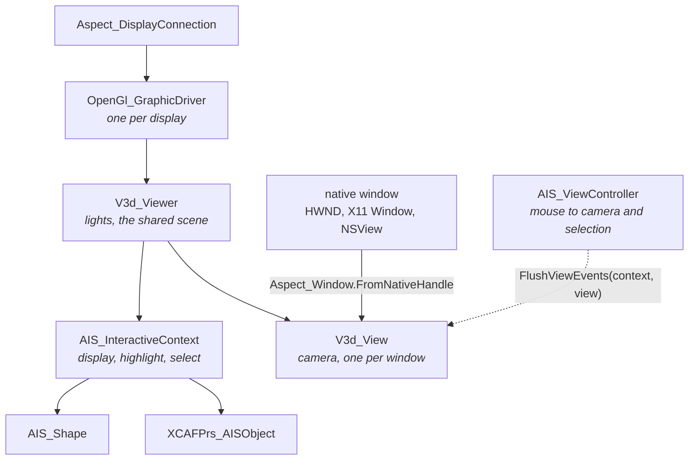
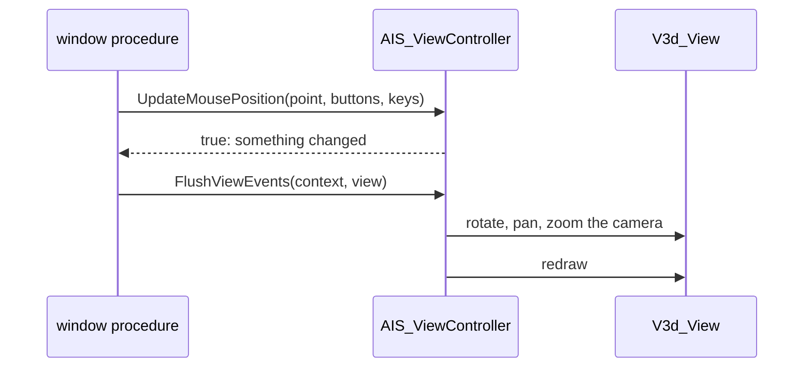

# 3D views

OCCT draws with OpenGL into a native window: an HWND on Windows, an X11 window on Linux, an NSView on macOS. The UI framework provides the window, NetOcc's `Aspect_Window.FromNativeHandle` wraps it for the view.

## The viewer

[!code-csharp]

After that, the window's events drive the view: on a resize `View.MustBeResized()`, on a paint `View.Redraw()`. Dispose it on the UI thread before the window is destroyed, see [Object lifetimes](lifetimes.md#threads).

## Hosting the window

The view needs a child window of its own, which also receives the mouse:

- **Win32:** register a window class with `CS_OWNDC` (OpenGL needs its own device context) and a window procedure that passes size, paint and mouse messages on to the view.
- **WPF:** an `HwndHost` creates that window in `BuildWindowCore`.
- **Avalonia:** a `NativeControlHost` creates it in `CreateNativeControlCore`, once the control is shown.

The [demos](https://github.com/paulbuechner/netocc/tree/main/netocc-demos) do all of this in a WPF and an Avalonia 12 viewer that open STEP files; `NetOcc.Viewer` has the shared part.

## Presentations

What the context displays are presentations: `AIS_Shape` for a shape, `XCAFPrs_AISObject` for a document label with its colors. They hold the display attributes:

[!code-csharp]

| Display mode | Shows |
|---|---|
| `AIS_WireFrame` (0) | edges and isolines |
| `AIS_Shaded` (1) | shaded faces |

The view triangulates shapes when it shows them, with a deflection relative to their size; mesh them yourself first for control over it.

## Documents

[!code-csharp]

## Camera

[!code-csharp]

`V3d_View.Camera()` gives the `Graphic3d_Camera` for full control: eye, center, up, projection, field of view.

## Mouse input

`AIS_ViewController` turns input into rotation (left button), panning (middle), zoom (right button, wheel) and selection (click). Positions are the window's pixels. Buttons and modifier keys are OCCT bit masks OCCT declares in anonymous enums, so C# repeats them: buttons left `1 << 13`, middle `1 << 14`, right `1 << 15`; keys shift `1 << 8`, control `1 << 9`, alt `1 << 10`.

[!code-csharp]

`UpdateMouseButtons` takes button presses and releases the same way.

## Selection

The context highlights what's under the mouse and selects on click; selection modes choose what can be picked:

[!code-csharp]

| Selection mode | Picks |
|---|---|
| `0` | the whole presentation |
| `AIS_Shape.SelectionMode(TopAbs_VERTEX)`, `EDGE`, `WIRE`, `FACE`, `SOLID` | sub-shapes of that type |

## Threads and disposal

Views, the driver and presentations belong to the thread that made them, the UI thread: create, use and dispose them there. Dispose in reverse order of creation (view, viewer, driver), see [Object lifetimes](lifetimes.md#threads).
