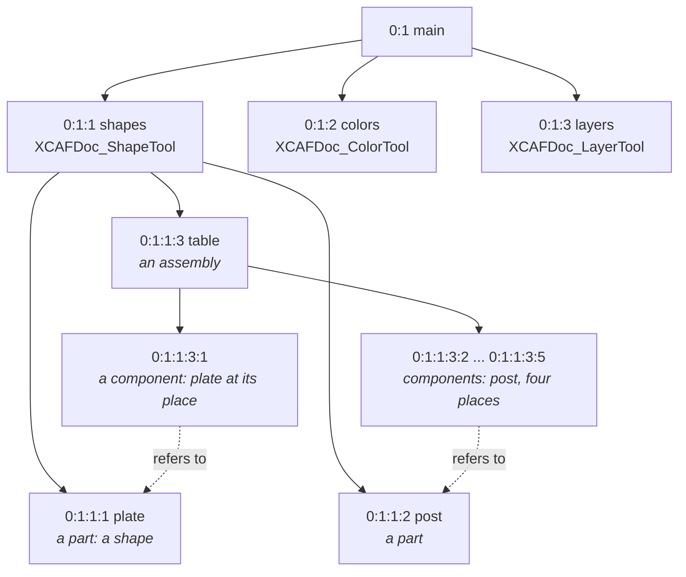

# Assemblies

XCAF (Extended CAF) documents hold what a STEP file has beyond geometry: product structure, names, colors, layers, materials, PMI. They are [OCAF documents](ocaf.md) with a fixed layout, managed by tools: `XCAFDoc_ShapeTool` for shapes and assemblies, `XCAFDoc_ColorTool` for colors, `XCAFDoc_LayerTool` for layers.

## The label tree

A table made of a plate and one post placed four times:

| Label | `XCAFDoc_ShapeTool` test | Holds |
|---|---|---|
| part | `IsSimpleShape` | a shape, defined once |
| assembly | `IsAssembly` | components |
| component | `IsReference` (`IsComponent`) | a reference to a part or an assembly, and a location |
| free shape | `IsFree` | a part or an assembly nothing refers to: a root |

Names (`TDataStd_Name`) and colors sit on any of them: a component's name is the instance's, and its color overrides its part's.

## Writing

[!code-csharp]

`AddShape(shape, true)` (the default) turns a compound into an assembly with its children as parts; `false` keeps it one part.

## Reading

Walk the tree from the free shapes, following references and composing locations:

[!code-csharp]

Colors come in three kinds: `XCAFDoc_ColorGen` (the whole shape), `XCAFDoc_ColorSurf` (faces), `XCAFDoc_ColorCurv` (edges). Readers put a STEP file's colors where the file had them; ask for more than one kind. Faces can have their own colors: `XCAFDoc_ShapeTool.GetSubShapes` lists the labels of colored sub-shapes.

## Showing a document

`XCAFPrs_AISObject` shows a label with its colors, see [3D views](visualization.md#documents).

> [!IMPORTANT]
> `XCAFApp_Application.GetApplication()` is one per process. Close each document with `application.Close(document)`: OCCT keeps documents it opened until then.
